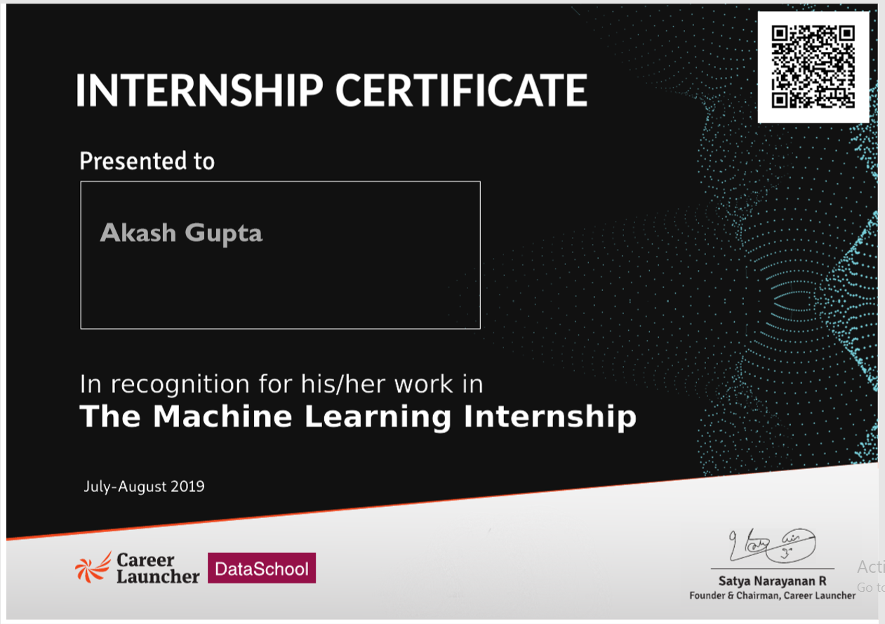
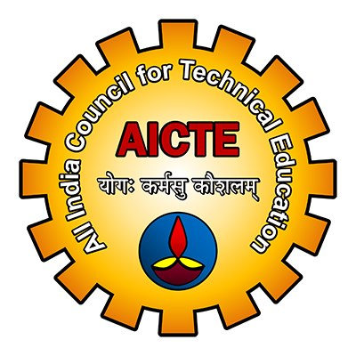

# Software & Training Partner

## certi

## Endorsed by

# Machine-Learning-Internship
AICTE endorsed Machine Learning Internship. 

## Internship
This internship is endorsed and co-certified by AICTE for all technical colleges in India. Intel® is our software and hardware partner for all of our data science programs.

# Overview of Machine Learning Internship
This Machine Learning Internship is a great way for you to start your data science career. It is designed to, both, test your knowledge and to give you the feel and experience of a real-world data science problem. Here is an overview of this 8-week internship

## Weekly Assignments:
## Mentoring:
## Learning Videos:
## Final Interview with Experts:
## Internship Certificate: 
